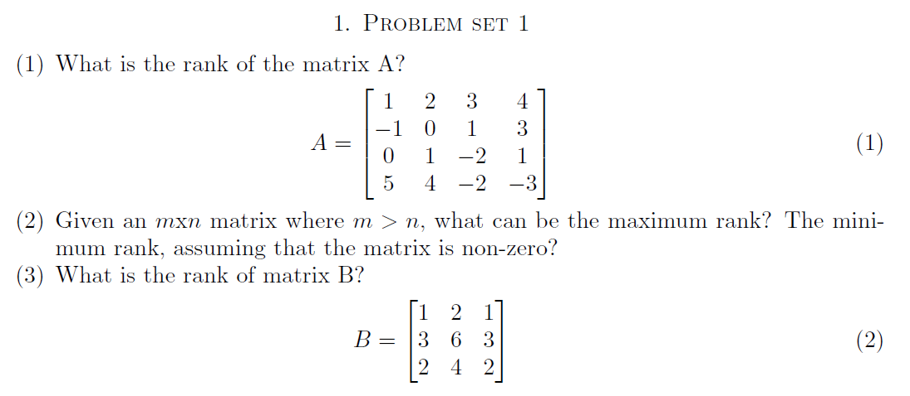
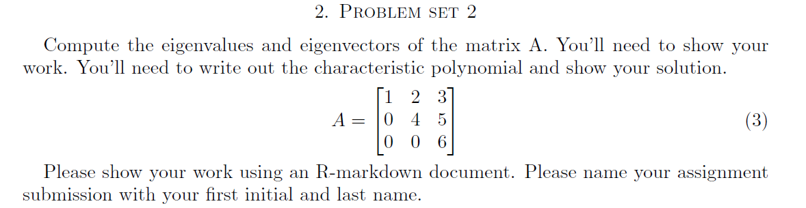

```{r , echo=T, message=F, warning=F}
library(pracma)
```



**_A: (1)_**

**_The set of pivot columns of any reduced row echelon form matrix is known as Rank._**

```{r, echo=T}
#Create a matrix
A = matrix(c(1,-1,0,5, 2,0,1,4, 3,1,-2,-2, 4,3,1,-3),ncol = 4)

A

#Using qr function calculate rank
rankA <- qr(A)
rankA$rank
```

**_Rank of the matrix A: `r rankA$rank`_**

```{r, echo=T}
#reduced row echelon form matrix
rrefA = rref(A)
rrefA
```

**_Reduced row echelon form of matrix A shows each column is linearly indepentent, hence rank is `r rankA$rank`._**

**_A: (2)_**

**_According to theorem Computing Rank and Nullity(CRN), suppose that A is an m x n matrix and B is a row-equivalent matrix in reduced row-echelon form. Let r denote the number of pivot columns (or the number of nonzero rows). Then $r(A) = r$ and $n(A) = n - r$._**

**_According to theorem Rank Plus Nullity(RPNC) is Columns, suppose that A is an m x n matrix. Then $r(A) + n(A) = n$._**

**_Using both theorems, it can be concluded that an m x n matrix can only have single rank and it is defined as minimum(m,n). If rank is equal to n(number of columns) $r(A) = n$, then it is called as full rank. A matrix is said to be rank deficient if it does not have full rank, $r(A) < n$._**

**_Using given conditions of the problem, m > n, hence $r(A) \le n$._**

**_A: (3)_**

```{r, echo=T}
#Create a matrix
B = matrix(c(1,3,2, 2,6,4, 1,3,2),ncol = 3)

B

#Using qr function calculate rank
rankB <- qr(B)
rankB$rank
```

**_Rank of the matrix B: `r rankB$rank`_**

```{r, echo=T}
#reduced row echelon form matrix
rrefB = rref(B)
rrefB
```

**_Reduced row echelon form of matrix B shows only one non-zero row, hence rank is `r rankB$rank`._**




**_A: Characteristic polynomial_**

```{r, echo=T}
#define matrix
A = matrix(c(1,0,0, 2,4,0, 3,5,6),ncol = 3)

cp = charpoly(A)

#Characteristic polynomial
cp
```

**_Characteristic polynomial equation for given matrix is $`r cp[1]`x^3 `r cp[2]`x^2 + `r cp[3]`x `r cp[4]`$_**

**_Eigenvalues_**

**_According to theorem EMRCP, Eigenvalues of a Matrix are Roots of Characteristic Polynomials Suppose A is a square matrix. Then $\lambda$ is an eigenvalue of A if and only if $p_{A} (\lambda) = 0$_**

**_By setting the characteristic polynomial equation equal to zero, $p_{A}(x) = `r cp[1]`x^3 `r cp[2]`x^2 + `r cp[3]`x `r cp[4]` = 0$_**

```{r, echo=T}
ev = eigen(A)
ev$values
```

**_Roots are $x = `r ev$values[1]`, x = `r ev$values[2]`$ and $x = `r ev$values[3]`$._**

**_Eigenvalues of given matrix are $\lambda = `r ev$values[1]`, \lambda = `r ev$values[2]`$ and $\lambda = `r ev$values[3]`$_**

**_Eigenvectors_**

**_$\lambda = `r ev$values[1]`, A - \lambda I_{3}$_**

```{r, echo=T}
lambda = ev$values[1]
lambdaI = lambda * diag(3)

result = A - lambdaI

#using pracma library get reduced row echelon form for result
rrefMx = rref(result)
rrefMx
```

**_Null space, ${\cal E}_{A}(`r ev$values[1]`) = {\cal N}(A - (`r ev$values[1]`I_{3}))$_**

${\cal N}(A + `r ev$values[1]`I_{3}) = \left[\begin{array}{cc}`r rrefMx[1,1]` & `r rrefMx[1,2]` & `r rrefMx[1,3]` \\`r rrefMx[2,1]` & `r rrefMx[2,2]` & `r rrefMx[2,3]` \\`r rrefMx[3,1]` & `r rrefMx[3,2]` & `r rrefMx[3,3]` \end{array}\right] \left[\begin{array}{cc}v_1 \\ v_2 \\ v_3\end{array}\right] = \left[\begin{array}{cc}0 \\ 0 \\ 0\end{array}\right]$

**_Solving the equations, _**
$v_1  `r rrefMx[1,3]`v_3 = 0,\ v_2 `r rrefMx[2,3]`v_3 = 0$

$if\ v_3 = t, then\ v_1 = `r -1*rrefMx[1,3]`t, v_2 = `r -1*rrefMx[2,3]`t$

${\cal E}_{A}(`r ev$values[1]`) = \left\{\left[\begin{array}{cc} v_1 \\ v_2 \\ v_3\end{array}\right] = t\left[\begin{array}{cc} `r -1*rrefMx[1,3]` \\ `r -1*rrefMx[2,3]` \\ 1\end{array}\right] | t\ \epsilon\ Real\ Numbers\right\}$

**_Eigenspace for $\lambda = `r ev$values[1]`$ is ${\cal E}_{A}(`r ev$values[1]`) = \left\langle\left[\begin{array}{cc} `r -1*rrefMx[1,3]` \\ `r -1*rrefMx[2,3]` \\ 1\end{array}\right]\right\rangle$_**

**_$\lambda = `r ev$values[2]`, A - \lambda I_{3}$_**

```{r, echo=T}
lambda = ev$values[2]
lambdaI = lambda * diag(3)

result = A - lambdaI

#using pracma library get reduced row echelon form for result
rrefMx = rref(result)
rrefMx
```

**_Null space, ${\cal E}_{A}(`r ev$values[2]`) = {\cal N}(A - (`r ev$values[2]`I_{3}))$_**

${\cal N}(A + `r ev$values[2]`I_{3}) = \left[\begin{array}{cc}`r rrefMx[1,1]` & `r rrefMx[1,2]` & `r rrefMx[1,3]` \\`r rrefMx[2,1]` & `r rrefMx[2,2]` & `r rrefMx[2,3]` \\`r rrefMx[3,1]` & `r rrefMx[3,2]` & `r rrefMx[3,3]` \end{array}\right] \left[\begin{array}{cc}v_1 \\ v_2 \\ v_3\end{array}\right] = \left[\begin{array}{cc}0 \\ 0 \\ 0\end{array}\right]$

**_Solving the equations, _**
$v_1  `r rrefMx[1,2]`v_2 = 0,\ v_3 = 0$

$if\ v_2 = t, then\ v_1 = `r -1*rrefMx[1,2]`t$

${\cal E}_{A}(`r ev$values[2]`) = \left\{\left[\begin{array}{cc} v_1 \\ v_2 \\ v_3\end{array}\right] = t\left[\begin{array}{cc} `r -1*rrefMx[1,2]` \\ 1 \\ 0\end{array}\right] | t\ \epsilon\ Real\ Numbers\right\}$

**_Let $t = `r -1*rrefMx[1,2]` | {t\ \epsilon\ Real\ Numbers}$_**

${\cal E}_{A}(`r ev$values[2]`) = \left\{\left[\begin{array}{cc} v_1 \\ v_2 \\ v_3\end{array}\right] = `r -1*rrefMx[1,2]`\left[\begin{array}{cc} `r (-1*rrefMx[1,2]) / (-1*rrefMx[1,2])` \\ `r 1 / (-1*rrefMx[1,2])` \\ 0\end{array}\right] | t\ \epsilon\ Real\ Numbers\right\}$

**_Eigenspace for $\lambda = `r ev$values[2]`$ is ${\cal E}_{A}(`r ev$values[2]`) = \left\langle\left[\begin{array}{cc} `r (-1*rrefMx[1,2]) / (-1*rrefMx[1,2])` \\ `r 1 / (-1*rrefMx[1,2])` \\ 0\end{array}\right]\right\rangle$_**


**_$\lambda = `r ev$values[3]`, A - \lambda I_{3}$_**

```{r, echo=T}
lambda = ev$values[3]
lambdaI = lambda * diag(3)

result = A - lambdaI

#using pracma library get reduced row echelon form for result
rrefMx = rref(result)
rrefMx
```

**_Null space, ${\cal E}_{A}(`r ev$values[3]`) = {\cal N}(A - (`r ev$values[3]`I_{3}))$_**

${\cal N}(A + `r ev$values[3]`I_{3}) = \left[\begin{array}{cc}`r rrefMx[1,1]` & `r rrefMx[1,2]` & `r rrefMx[1,3]` \\`r rrefMx[2,1]` & `r rrefMx[2,2]` & `r rrefMx[2,3]` \\`r rrefMx[3,1]` & `r rrefMx[3,2]` & `r rrefMx[3,3]` \end{array}\right] \left[\begin{array}{cc}v_1 \\ v_2 \\ v_3\end{array}\right] = \left[\begin{array}{cc}0 \\ 0 \\ 0\end{array}\right]$

**_Solving the equations, _**
$v_2 = 0,\ v_3 = 0$

$let\ v_1 = t$

${\cal E}_{A}(`r ev$values[3]`) = \left\{\left[\begin{array}{cc} v_1 \\ v_2 \\ v_3\end{array}\right] = t\left[\begin{array}{cc} 1 \\ 0 \\ 0\end{array}\right] | t\ \epsilon\ Real\ Numbers\right\}$

**_Eigenspace for $\lambda = `r ev$values[3]`$ is ${\cal E}_{A}(`r ev$values[3]`) = \left\langle\left[\begin{array}{cc} 1 \\ 0 \\ 0\end{array}\right]\right\rangle$_**

**_Solving using eigen function from R_**

```{r, echo=T}
#eigenvectors values from eigen function
ev$vectors
```

**_Eigenspace for $\lambda = `r ev$values[1]`$_**

```{r, echo=T}
#for lambda to 6
ev$values[1]
es = ev$vectors[,1]
es
#let minT be min value of vector
minT = min(es)
```
${\cal E}_{A}(`r ev$values[1]`) = \left\{\left[\begin{array}{cc} v_1 \\ v_2 \\ v_3\end{array}\right] = t\left[\begin{array}{cc} `r es[1]` \\ `r es[2]` \\ `r es[3]`\end{array}\right] | t\ \epsilon\ Real\ Numbers\right\}$

**_Let $t = `r minT` | {t\ \epsilon\ Real\ Numbers}$_**

${\cal E}_{A}(`r ev$values[1]`) = \left\{\left[\begin{array}{cc} v_1 \\ v_2 \\ v_3\end{array}\right] = `r minT`\left[\begin{array}{cc} `r es[1]/minT` \\ `r es[2]/minT` \\ `r es[3]/minT`\end{array}\right] | `r minT`\ \epsilon\ Real\ Numbers\right\}$

**_Eigenspace for $\lambda = `r ev$values[1]`$ is ${\cal E}_{A}(`r ev$values[1]`) = \left\langle\left[\begin{array}{cc} `r es[1]/minT` \\ `r es[2]/minT` \\ `r es[3]/minT`\end{array}\right]\right\rangle$_**


**_Eigenspace for $\lambda = `r ev$values[2]`$_**

```{r, echo=T}
#for lambda to 4
ev$values[2]
es = ev$vectors[,2]
es
#let minT be min value of vector
minT = min(es[es > 0])
```
${\cal E}_{A}(`r ev$values[2]`) = \left\{\left[\begin{array}{cc} v_1 \\ v_2 \\ v_3\end{array}\right] = t\left[\begin{array}{cc} `r es[1]` \\ `r es[2]` \\ `r es[3]`\end{array}\right] | t\ \epsilon\ Real\ Numbers\right\}$

**_Let $t = `r minT` | {t\ \epsilon\ Real\ Numbers}$_**

${\cal E}_{A}(`r ev$values[2]`) = \left\{\left[\begin{array}{cc} v_1 \\ v_2 \\ v_3\end{array}\right] = `r minT`\left[\begin{array}{cc} `r es[1]/minT` \\ `r es[2]/minT` \\ `r es[3]/minT`\end{array}\right] | `r minT`\ \epsilon\ Real\ Numbers\right\}$

**_Eigenspace for $\lambda = `r ev$values[2]`$ is ${\cal E}_{A}(`r ev$values[2]`) = \left\langle\left[\begin{array}{cc} `r es[1]/minT` \\ `r es[2]/minT` \\ `r es[3]/minT`\end{array}\right]\right\rangle$_**


**_Eigenspace for $\lambda = `r ev$values[3]`$_**

```{r, echo=T}
#for lambda to 1
ev$values[3]
es = ev$vectors[,3]
es
#let minT be min value of vector
minT = min(es[es > 0])
```
${\cal E}_{A}(`r ev$values[3]`) = \left\{\left[\begin{array}{cc} v_1 \\ v_2 \\ v_3\end{array}\right] = t\left[\begin{array}{cc} `r es[1]` \\ `r es[2]` \\ `r es[3]`\end{array}\right] | t\ \epsilon\ Real\ Numbers\right\}$

**_Let $t = `r minT` | {t\ \epsilon\ Real\ Numbers}$_**

${\cal E}_{A}(`r ev$values[3]`) = \left\{\left[\begin{array}{cc} v_1 \\ v_2 \\ v_3\end{array}\right] = `r minT`\left[\begin{array}{cc} `r es[1]/minT` \\ `r es[2]/minT` \\ `r es[3]/minT`\end{array}\right] | `r minT`\ \epsilon\ Real\ Numbers\right\}$

**_Eigenspace for $\lambda = `r ev$values[3]`$ is ${\cal E}_{A}(`r ev$values[3]`) = \left\langle\left[\begin{array}{cc} `r es[1]/minT` \\ `r es[2]/minT` \\ `r es[3]/minT`\end{array}\right]\right\rangle$_**

**_Eigenspace values are same, solving manually matches R function eigen._**


